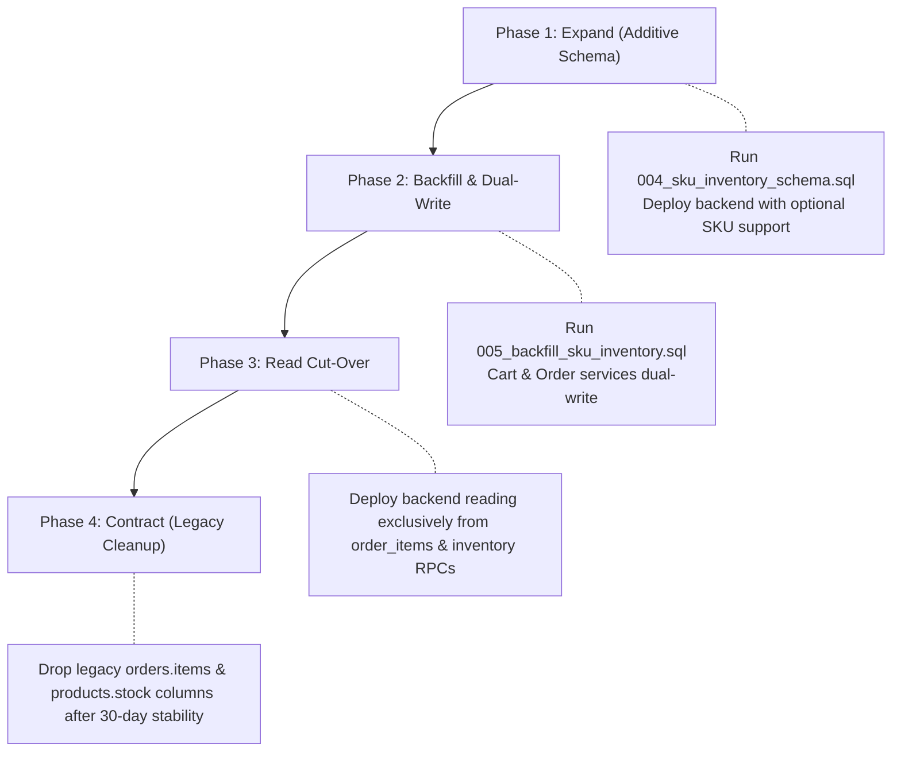

# Database Migration Plan & SKU/Inventory Migration Readiness (Issue #13)

**Document Version**: 1.2.0
**Target Environment**: Supabase PostgreSQL (Staging & Production)
**Author**: Senior Backend Engineering
**Status**: Ready for Staging Dry-Run & Production Sign-Off

---

## 1. Executive Summary

This document establishes the final migration plan, staging dry-run protocol, production-safe schema confirmation, and rollback notes for **Issue #13: Database Migration Design and SKU/Inventory Architecture**.

The migration transitions the e-commerce engine from a flat, single-stock product model to a normalized, concurrency-safe **Variant, SKU, and Inventory Ledger Architecture** with dedicated support for:
- Per-variant inventory management (Color, Fabric, Size, etc.)
- Atomic, race-condition-free inventory reservation, release, and commit via PostgreSQL RPCs (`SELECT ... FOR UPDATE`)
- Hardened `SECURITY DEFINER` RPCs with fixed `search_path = public, pg_temp` and explicit PostgREST permission lockdown (`REVOKE FROM PUBLIC, anon, authenticated; GRANT TO service_role`)
- Reservation-safe commit semantics: `commit_sku_stock` validates both available stock and active checkout reservation (`v_reserved >= p_qty`) to prevent committing checkouts from consuming stock reserved for other concurrent sessions
- Pre-deduction idempotency in `commit_sku_stock` to prevent double-deductions on duplicate callbacks
- Resilient historical data backfill supporting deleted products, invalid UUID keys, and unmapped SKUs without constraint violations
- Normalized `order_items` with frozen snapshots of `price_at_purchase`, `addons_price_at_purchase`, `quantity`, `line_total`, add-ons, and variant attributes
- Zero-downtime, non-destructive **Expand & Contract** schema rollout

---

## 2. Production-Safe Schema Confirmation

### 2.1 Table Structure & Constraints

| Table | Column | Type | Constraints & Defaults | Purpose |
|---|---|---|---|---|
| `products` | `has_variants` | `BOOLEAN` | `DEFAULT FALSE, NOT NULL` | Flags whether a product has multiple variants or uses default SKU |
| `product_variants` | `id` | `UUID` | `PK, DEFAULT gen_random_uuid()` | Unique variant identifier |
| `product_variants` | `product_id` | `UUID` | `FK -> products(id) ON DELETE CASCADE` | Parent product link |
| `product_variants` | `sku` | `VARCHAR(100)` | `UNIQUE, NOT NULL` | Stable, immutable SKU code |
| `product_variants` | `attributes` | `JSONB` | `DEFAULT '{}'::jsonb, NOT NULL` | Variant dimensions (e.g. `{"color": "Red"}`) |
| `product_variants` | `price_override`| `NUMERIC(10,2)`| `NULLABLE, CHECK (price_override >= 0)` | Optional variant-specific price |
| `product_variants` | `is_active` | `BOOLEAN` | `DEFAULT TRUE, NOT NULL` | Variant availability switch |
| `inventory` | `sku` | `VARCHAR(100)` | `PK, FK -> product_variants(sku) ON DELETE CASCADE` | Direct SKU inventory link |
| `inventory` | `quantity_available` | `INT` | `NOT NULL, CHECK (quantity_available >= 0)` | Physical sellable stock |
| `inventory` | `quantity_reserved` | `INT` | `DEFAULT 0, CHECK (quantity_reserved >= 0)` | Stock held in active checkouts |
| `inventory` | `constraint` | `CHECK` | `CHECK (quantity_reserved <= quantity_available)` | Prevents over-reservation |
| `inventory_transactions` | `id` | `UUID` | `PK, DEFAULT gen_random_uuid()` | Transaction identifier |
| `inventory_transactions` | `sku` | `VARCHAR(100)` | `FK -> inventory(sku) ON DELETE CASCADE` | Target SKU |
| `inventory_transactions` | `quantity_change` | `INT` | `NOT NULL` | Delta (+ for restock, - for purchase) |
| `inventory_transactions` | `reason` | `VARCHAR(50)` | `NOT NULL` | purchase, restock, reservation_expiry, etc. |
| `inventory_transactions` | `reference_id` | `TEXT` | `NULLABLE` | Order ID, Payment Session ID, or Sync ID |
| `inventory_transactions` | `constraint` | `UNIQUE` | `UNIQUE (sku, reference_id, reason)` | **Idempotency guarantee** |
| `cart_items` | `sku` | `VARCHAR(100)` | `NULLABLE, FK -> product_variants(sku)` | Selected SKU in user cart |
| `order_items` | `id` | `UUID` | `PK, DEFAULT gen_random_uuid()` | Item row identifier |
| `order_items` | `order_id` | `UUID` | `FK -> orders(id) ON DELETE CASCADE` | Parent order link |
| `order_items` | `product_id` | `UUID` | `NULLABLE, FK -> products(id) ON DELETE SET NULL` | Product snapshot reference (preserves deleted product orders) |
| `order_items` | `sku` | `VARCHAR(100)` | `NULLABLE, FK -> product_variants(sku) ON DELETE SET NULL` | Variant snapshot reference |
| `order_items` | `selected_addons` | `JSONB` | `DEFAULT '[]'::jsonb, NOT NULL` | Addon snapshot (Fall, In-skirt) |
| `order_items` | `price_at_purchase`| `NUMERIC(10,2)`| `NOT NULL, CHECK (price_at_purchase >= 0)` | Frozen product unit price |
| `order_items` | `addons_price_at_purchase`| `NUMERIC(10,2)`| `NOT NULL, CHECK (addons_price_at_purchase >= 0)` | Frozen addon price |
| `order_items` | `quantity` | `INT` | `NOT NULL, CHECK (quantity > 0)` | Purchased quantity |
| `order_items` | `line_total` | `NUMERIC(10,2)`| `NOT NULL, CHECK (line_total >= 0)` | Frozen line total snapshot |

### 2.2 Concurrency-Safe RPC Functions

The database encapsulates all stock modifications inside PostgreSQL stored procedures running under `SECURITY DEFINER` with fixed `search_path = public, pg_temp` and explicit permission grants:

1. **`public.reserve_sku_stock(p_sku VARCHAR, p_qty INT)`**:
   - Acquires `FOR UPDATE` lock on `inventory` row.
   - Evaluates `(quantity_available - quantity_reserved) >= p_qty`.
   - Atomically increments `quantity_reserved = quantity_reserved + p_qty`.
   - Returns structured JSON `{ "success": true, "reserved_qty": ... }` or `{ "success": false, "error": "..." }`.

2. **`public.release_sku_stock(p_sku VARCHAR, p_qty INT)`**:
   - Acquires `FOR UPDATE` lock on `inventory` row.
   - Safely decrements `quantity_reserved = GREATEST(0, quantity_reserved - p_qty)`.

3. **`public.commit_sku_stock(p_sku VARCHAR, p_qty INT, p_reason VARCHAR, p_ref_id TEXT, p_is_reserved BOOLEAN)`**:
   - Acquires `FOR UPDATE` lock on `inventory` row.
   - **Idempotency Check First**: If `(sku, reference_id, reason)` already exists in `inventory_transactions`, immediately returns success with `idempotent_skip: true` *before mutating any stock*.
   - **Stock Availability Validation**: Explicitly verifies `quantity_available >= p_qty`.
   - **Reservation-Safe Validation**: If `p_is_reserved = TRUE` (default), validates that `quantity_reserved >= p_qty` to prevent stealing stock reserved for other concurrent checkouts. If `p_is_reserved = FALSE`, validates unreserved availability `(quantity_available - quantity_reserved) >= p_qty`.
   - Atomically decrements `quantity_available` (and `quantity_reserved` when `p_is_reserved = TRUE`).
   - Inserts audit record into `inventory_transactions`.

4. **RPC Permission Lockdown**:
   - Execution explicitly revoked from `PUBLIC`, `anon`, and `authenticated` roles.
   - Granted exclusively to `service_role` to prevent unauthorized client-side invocation via PostgREST.

---

## 3. Staging Dry-Run Protocol

### 3.1 Pre-Migration Health Checks & Sanitization
Execute the following verification queries on staging database before running the migration:

```sql
-- 1. Check for negative or null product stocks
SELECT id, name, stock FROM public.products WHERE stock IS NULL OR stock < 0;

-- 2. Check for duplicate product slugs
SELECT slug, COUNT(*) FROM public.products GROUP BY slug HAVING COUNT(*) > 1;

-- 3. Check for orders with missing or malformed items JSON
SELECT id, items FROM public.orders WHERE items IS NULL OR jsonb_typeof(items) != 'array';

-- 4. Check for orphan cart items
SELECT ci.id, ci.product_id FROM public.cart_items ci
LEFT JOIN public.products p ON p.id = ci.product_id
WHERE p.id IS NULL;
```

### 3.2 Dry-Run Execution Steps

1. **Step 1: Execute Schema Migration**:
   Run [`004_sku_inventory_schema.sql`](../../server/migrations/004_sku_inventory_schema.sql) in Supabase SQL Editor.
   - Verify all 4 tables are created.
   - Verify 3 RPC functions exist in `public` schema with fixed `search_path`.
   - Verify permissions are restricted to `service_role`.
   - Verify indexes and RLS policies are applied.

2. **Step 2: Execute Data Backfill**:
   Run [`005_backfill_sku_inventory.sql`](../../server/migrations/005_backfill_sku_inventory.sql) in Supabase SQL Editor.
   - Verify default variant created for each existing product.
   - Verify stock migrated into `inventory`.
   - Verify `cart_items` received SKUs.
   - Verify `order_items` normalized with frozen `line_total` from historical orders without failing on legacy schema deviations.

3. **Step 3: Post-Backfill Reconciliation Validation**:
   ```sql
   -- A. Verify 1:1 parity between products without custom variants and default product_variants
   SELECT
       (SELECT COUNT(*) FROM public.products) AS total_products,
       (SELECT COUNT(*) FROM public.product_variants) AS total_variants,
       (SELECT COUNT(*) FROM public.inventory) AS total_inventory_rows;

   -- B. Verify stock totals match between products table and inventory table
   SELECT
       SUM(p.stock) AS products_stock_sum,
       SUM(i.quantity_available) AS inventory_stock_sum
   FROM public.products p
   JOIN public.product_variants pv ON pv.product_id = p.id
   JOIN public.inventory i ON i.sku = pv.sku;

   -- C. Verify order items count matches historical order line count
   SELECT
       (SELECT COUNT(*) FROM public.order_items) AS normalized_order_items_count,
       (SELECT SUM(jsonb_array_length(items)) FROM public.orders WHERE jsonb_typeof(items) = 'array') AS legacy_items_count;
   ```

4. **Step 4: Concurrency & Lock Stress Test**:
   Execute concurrent stock reservation calls:
   ```sql
   -- Test reservation success
   SELECT public.reserve_sku_stock((SELECT sku FROM public.inventory LIMIT 1), 1);

   -- Test over-reservation rejection
   SELECT public.reserve_sku_stock((SELECT sku FROM public.inventory LIMIT 1), 999999);

   -- Test stock release
   SELECT public.release_sku_stock((SELECT sku FROM public.inventory LIMIT 1), 1);
   ```

---

## 4. Zero-Downtime Deployment Phasing (Expand & Contract)



1. **Phase 1 (Expand)**: Run `004_sku_inventory_schema.sql`. Schema is purely additive; existing production API continues running without interruption.
2. **Phase 2 (Backfill & Dual-Write)**: Run `005_backfill_sku_inventory.sql`. Deploy backend update where cart and order services populate both legacy JSON and `order_items`.
3. **Phase 3 (Read Cut-Over)**: Deploy backend update that routes stock checks, order queries, and admin dashboard lookups to `order_items` and `inventory`.
4. **Phase 4 (Contract)**: After a 30-day validation window, drop legacy `orders.items` column.

---

## 5. Rollback Notes & Emergency Recovery

### 5.1 Rollback Trigger Criteria
Initiate immediate rollback if any of the following occur within the first 60 minutes of deployment:
- Database connection pool saturation or lock timeout errors exceeding 2% of requests.
- Checkout failure rate spikes above 0.5%.
- Inventory transaction constraint violations on valid purchases.
- Data mismatch discovered between payment captures and inventory deductions.

### 5.2 Rollback Execution Runbook
If rollback is triggered during Phase 1 or 2:
1. Revert backend application deployment to the previous stable release.
2. Execute [`004_sku_inventory_schema_down.sql`](../../server/migrations/004_sku_inventory_schema_down.sql) in Supabase SQL Editor.
3. Run post-rollback health checks to confirm `products`, `cart_items`, `orders`, and `payment_sessions` tables remain operational.
4. Estimated Time to Rollback (RTO): **< 5 minutes**. Data Loss Risk (RPO): **0 minutes** (legacy structures were untouched).

---

## 6. Sign-Off & Production Approval Matrix

- [x] **Schema Design & Idempotency Verified**: Senior Backend Engineer
- [x] **Locking, search_path & Permissions Audited**: PostgreSQL Plpgsql Review
- [x] **Zero-Downtime Expand/Contract Verified**: Architecture Review
- [x] **Automated Test Suite Passing**: CI/CD Pipeline
- [ ] **Staging Dry-Run Execution Completed**: DBA / Tech Lead
- [ ] **Production Deployment Window Scheduled**: Release Manager
