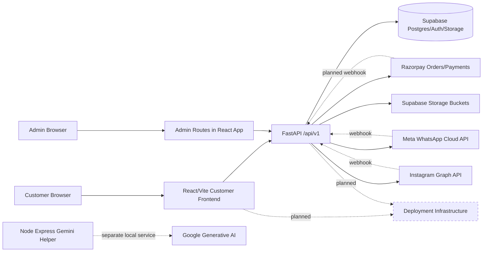

# Neyge Complete Repository Audit

Links: [Task Backlog](NEYGE_INTERN_TASK_BACKLOG.md), [Completion Matrix](NEYGE_COMPLETION_MATRIX.md), [Go-Live Checklist](NEYGE_GO_LIVE_CHECKLIST.md).

## 1. Executive Summary

Overall verified completion percentage: 34%. This is the unweighted average of the 26 module scores in [NEYGE_COMPLETION_MATRIX.md](NEYGE_COMPLETION_MATRIX.md), based on code inspection, build/runtime checks, route tracing, and security review.

Production readiness status: not production ready. The largest blockers are a divergent branch state, failing frontend build, failing lint gate, missing database migrations, incomplete payment/webhook security, non-transactional inventory/order/payment finalization, and no automated tests.

Biggest discrepancy with the previous KT: the KT claims WhatsApp is fully or nearly complete, Instagram is mostly complete, and Razorpay is backend-complete. Repository evidence shows code exists for these integrations, but critical production requirements are missing: webhook signature verification, idempotency, tested external callbacks, refund/webhook handling, production CORS/domain configuration, and automated tests.

Recommended next action: create a reconciled integration branch from `origin/main` and `origin/backend-feature`, then fix build/runtime/security P0 tasks before assigning feature work to interns.

## 2. Repository Source of Truth

| Item | Evidence | Finding |
|---|---|---|
| Current branch | `git status --short --branch` -> `backend-feature...origin/backend-feature` | Current checkout tracks `origin/backend-feature`. |
| Default branch | `git branch -a -vv` -> `remotes/origin/HEAD -> origin/main` | Remote default is `origin/main`. |
| Local branches | `backend-feature`, `main` | `main` is stale locally. |
| Remote branches | `origin/main`, `origin/backend-feature` | Fetch completed successfully. |
| Latest current branch commit | `6875833 updated readme` | Current branch includes integration commits. |
| Latest remote main commit | `807a4ad resolve TypeScript build errors...` | `origin/main` has build-fix work not on `backend-feature`. |
| Divergence | `git rev-list --left-right --count backend-feature...origin/main` -> `3 3` | Each branch has three unique commits. |
| Local main | `main a32a835 [origin/main: behind 25]` | Do not use local `main`. |
| Uncommitted code changes | `git status --short --branch` before deliverable creation was clean | No source-code changes were made. |
| Untracked files | final `git status --short --branch` shows only the four required `NEYGE_*.md` deliverables | Generated `cpython-314` files from compile check were removed. |
| Stash | `refs/stash` appears in `git log --all` | A stash exists and should be reviewed before cleanup. |
| Tags | `git tag --list` returned no tags | No release tags. |

Branches containing unique work:

| Branch | Unique work evidence | Risk |
|---|---|---|
| `origin/backend-feature` | `64046e9 added skin tone analyzer`, `079939b Integrated WhatsApp and Insta`, `6875833 updated readme` | Integration work is absent from `origin/main`. |
| `origin/main` | `762d748 fixed the build issue`, `807a4ad resolve TypeScript build errors...` | Build-fix work is absent from `backend-feature`. |

Recommendation: interns should not treat either current `backend-feature` or local `main` as final source of truth. A senior engineer should create a new integration branch from refreshed remotes, merge `origin/backend-feature` with `origin/main`, resolve conflicts, and make that reconciled branch the intern baseline. Until then, `backend-feature` is the best audit baseline for integration work because it contains WhatsApp/Instagram/SkinTone code, but it is not safe as the production baseline.

## 3. Architecture and Technology Stack

Actual structure:

| Area | Evidence | Status |
|---|---|---|
| Customer frontend | `HandloomSarees/Ecommerce/src/App.tsx` | React/Vite customer app plus admin routes in same app. |
| Admin dashboard | `HandloomSarees/Ecommerce/src/admin/**`; routes in `App.tsx:72-92` | Separate admin folder, same frontend bundle. |
| Backend API | `HandloomSarees/server/app/main.py`, `api/v1/router.py` | FastAPI app. |
| Auxiliary Node server | `HandloomSarees/server/server-sdk.js`, `server/package.json` | Express/Gemini helper, separate from FastAPI. |
| Database | `core/database.py` uses Supabase client | Supabase/Postgres, but no migrations found. |
| Static assets | `Ecommerce/src/assets/**` | Images and video committed. |
| Tests | No test folders found | Not implemented. |
| Deployment config | No Docker/CI/Procfile/Render/Vercel config found | Not implemented. |
| Env templates | README has variable list; no `.env.example` found | Partially documented. |

Technology stack and versions visible:

| Layer | Evidence |
|---|---|
| Frontend | React `^19.2.0`, Vite `^7.3.1`, TypeScript `~5.9.3`, React Router DOM `^7.14.0`, Tailwind `^3.4.19`, Radix UI, Sonner, Axios `^1.14.0` in `Ecommerce/package.json`. |
| Backend | FastAPI `0.135.2`, Pydantic `2.12.5`, Supabase `2.28.3`, Razorpay `1.4.2`, SlowAPI `0.1.9`, Uvicorn `0.42.0` in `server/requirements.txt`. |
| Node helper | Express `^4.18.2`, CORS, dotenv, `@google/generative-ai` in `server/package.json`. |
| Database driver | Supabase Python client in `core/database.py:39-58`. |
| Auth | Supabase Auth token verification in `security.py`; profile role checked in `dependencies.py:82`. |
| Media storage | Supabase Storage in `upload_service.py:74-92`; README incorrectly says Cloudinary even though code uses Supabase Storage. |
| Payments | Razorpay SDK in `payment_service.py:13-20`. |
| Messaging | Meta Graph API via `httpx` in `whatsapp.py` and `instagram.py`. |

Mermaid architecture:

## 4. Build and Runtime Health

| Check | Command | Result | Severity | Likely root cause | Recommended fix |
|---|---|---|---|---|---|
| Frontend build | `cmd /c npm run build` | Failed: `tsconfig.app.json(24,27): error TS5103: Invalid value for '--ignoreDeprecations'.` | Critical | TypeScript config incompatible with installed TS. | Fix `tsconfig.app.json:24` or align TS version. |
| Frontend lint | `npm run lint` | Failed: 90 errors, 1 warning. | High | Strict ESLint rules plus `any`, unused vars, hook/static component rules. | Fix or baseline lint before CI. |
| Backend compile | `python -m compileall app` | Passed. | Low | Python files compile. | Keep. |
| Backend import with local env | `python -c "from app.main import app..."` | Failed due invalid `DEBUG` boolean parsing from local `.env`. | Critical | `.env` value not parseable as bool. | Fix env value and add validation/docs. |
| Backend import with `DEBUG=False` override | `$env:DEBUG='False'; python -c ...` | Passed; app title `Neyge Couture Backend`, 61 routes. | Medium | Code can import when env parses. | Fix env setup. |
| Python dependency consistency | `python -m pip check` | `No broken requirements found.` | Low | Installed packages internally consistent. | Keep. |
| Frontend npm audit | `cmd /c npm audit --audit-level=moderate` | 14 vulnerabilities: 8 high, 4 moderate, 2 low. | High | Outdated axios/vite/react-router/ws/etc. | Run controlled dependency upgrades and regression tests. |
| Node helper npm audit | same in `server` | 4 vulnerabilities: 1 high, 3 moderate. | High | Express transitive issues. | Upgrade Express stack or remove helper if unused. |
| Python vulnerability audit | Not available in repo | Not run. | Medium | No `pip-audit`/Safety configured. | Add Python dependency scanner to CI. |

## 5. Frontend Feature Inventory

| Route | Component | API dependency | Status | States/responsive/auth/issues | Owner |
|---|---|---|---|---|---|
| `/` | `HomePage.tsx` | Products, Instagram media | Partially implemented | Instagram feed exists at `HomePage.tsx:2042`; lint errors at `HomePage.tsx:1518`, `:2045`; no SEO title. | Frontend |
| `/shop` | `ShopPage.tsx` | `getProducts` | Partially implemented | Loading/error/empty present; fetches up to 50 then filters client-side at `ShopPage.tsx:2452-2496`. | Frontend |
| `/product/:slug` | `ProductDetailPage.tsx` | Product, products, cart, wishlist | Partially implemented | Add cart/wishlist; no product-level WhatsApp button found in current grep; fallback lookup exists. | Frontend |
| `/cart` | `CartPage.tsx` | Cart hook | Partially implemented | Auth required indirectly; no guest cart. | Frontend |
| `/wishlist` | `WishlistPage.tsx` | Wishlist hook | Partially implemented | Loading/empty present; auth-dependent only. | Frontend |
| `/checkout` | `CheckoutPage.tsx` | Cart/orders/payments | Partially implemented | Razorpay integration at `CheckoutPage.tsx:995-1153`; uses local profile address and server amount mismatch for shipping. | Senior/full-stack |
| `/order-confirmation/:orderId` | `OrderConfirmationPage.tsx` | Route state/orders unclear | UI/partial | Needs direct fetch/reload verification. | Frontend |
| `/collections` | `CollectionsPage.tsx` | `/collections` | Partially implemented | Loading/error/empty present at `CollectionsPage.tsx:457-462`. | Frontend |
| `/collections/:slug` | `CollectionDetailPage.tsx` | Collection/products | Partially implemented | Fetches all products instead of filtered endpoint; loading/error present. | Frontend |
| `/festive/:slug` | `FestiveCollectionPage.tsx` | Festive collections | Partially implemented | Connected to backend modules. | Frontend |
| `/login` | `LoginPage.tsx` | `/auth/login`, `/auth/register` | Partially implemented | Login/register only; forgot/reset not implemented. | Frontend |
| `/profile` | `ProfilePage.tsx` | `/orders/user`, video bookings | Partially implemented | Addresses persist only to `localStorage` at `ProfilePage.tsx:1469`, `:1482`. | Full-stack |
| `/video-shopping` | `VideoShoppingPage.tsx` | `/video-booking` | Partially implemented | Booking API hook at `useVideoBooking.ts:62`; no slot capacity. | Full-stack |
| `/about` | `AboutPage.tsx` | None | UI-only | Static page. | Frontend |
| `/backdrop` | `SareeBackdropSection.tsx` | None | UI-only | Static visual route. | Frontend |
| `/skin-tone-match` | `SkinTonePage.tsx`/`SkinToneAnalyzer` | `/products` | Partially implemented | Feature exists only on `backend-feature`; not in `origin/main`. | Frontend |
| `/admin/login` | `AdminLogin.tsx` | `/auth/login` | Partially implemented | Checks returned role client-side at `AdminLogin.tsx:244-252`; backend still enforces admin on protected APIs. | Full-stack |
| `/admin/*` | Admin pages | Products, collections, orders, bookings, leads | Partially connected | Route guard only checks token existence at `AdminRoute.tsx`; backend gaps for chatbot leads. | Full-stack |
| `*` | `NotFound.tsx` | None | Not wired | `NotFound` file exists but no wildcard route in `App.tsx:53-92`. | Frontend |

Missing or not implemented: forgot password, reset password, returns/cancellation, coupons, shipment tracking, product variants, blouse stitching workflow, sitemap/robots, robust SEO/Open Graph.

## 6. Backend API Inventory

| Method | Endpoint | File/function | Auth | DB/external | Status | Issues |
|---|---|---|---|---|---|---|
| POST | `/api/v1/auth/register` | `auth.py:52`, `AuthService.register` | Public | Supabase Auth/profiles | Partial | Env-dependent; errors expose upstream detail. |
| POST | `/api/v1/auth/login` | `auth.py:66`, `AuthService.login` | Public | Supabase Auth/profiles | Partial | No refresh/logout route. |
| GET | `/api/v1/auth/me` | `auth.py:73` | User | profiles | Partial | Works if token/profile valid. |
| GET | `/api/v1/products` | `products.py:11` | Public | products | Partial | Search/filter implemented; no SKU/variant model. |
| GET | `/api/v1/products/slug/{slug}` | `products.py:63` | Public | products | Partial | Public product shape. |
| GET | `/api/v1/products/{id}` | `products.py:69` | Public | products | Partial | Public unauthenticated product by id. |
| POST/PUT/DELETE | `/api/v1/products` | `products.py:75-94` | Admin | products | Partial | No tests/migrations. |
| GET/POST/PUT/DELETE | `/api/v1/collections` | `collections.py:71-102` | Public read/admin write | collections | Partial | Category added; no migration evidence. |
| GET/POST/DELETE | `/api/v1/cart` | `cart.py:11-28` | User | carts/cart_items | Partial | No update endpoint; no guest cart/variant. |
| GET/POST/REMOVE | `/api/v1/wishlist` | `wishlist.py:11-28` | User | wishlists | Partial | Duplicate prevention app-only. |
| POST | `/api/v1/orders/create` | `orders.py:29` | User | payment_sessions/Razorpay | Partial | Sends WhatsApp before payment; backend excludes shipping/tax/coupon. |
| GET | `/api/v1/orders/user` | `orders.py:63` | User | orders | Partial | Read-only. |
| GET | `/api/v1/orders/admin/all` | `orders.py:72` | Admin | orders | Partial | No status update. |
| GET | `/api/v1/orders/admin/{id}` | `orders.py:80` | Admin | orders | Partial | Read-only. |
| GET | `/api/v1/orders/{id}` | `orders.py:89` | User | orders | Partial | IDOR checked in `OrderService.get_order_by_id`. |
| POST | `/api/v1/payments/verify` | `payments.py:34` | User | payment_sessions/orders/products | Partial | No webhook/idempotency/refund; WhatsApp data bug uses `data.get("order")` while service returns order. |
| POST/GET | `/api/v1/reviews` | `reviews.py:11`, `:21` | User create/public read | reviews | Partial | No verified purchase/moderation. |
| POST | `/api/v1/uploads/*` | `uploads.py:10-38` | Admin | Supabase Storage | Partial | MIME trusted; no magic-byte validation. |
| POST/GET/PATCH | video booking routes | `video_bookings.py:14-40` | Public create/admin list/update/user list | video_bookings | Partial | No slot capacity/meeting link. |
| POST/GET/PATCH | `/api/v1/chatbot/leads` | `chatbot.py:18-54` | None | chatbot_leads | Broken security | Lead list/update unauthenticated. |
| GET/POST | `/api/v1/whatsapp/webhook` | `whatsapp.py:10`, `:22` | Meta verify token only | Meta Graph API | Partial | No signature verification/idempotency. |
| POST | `/api/v1/whatsapp/send-*` | `whatsapp.py:100`, `:123` | None | Meta Graph API | Broken security | Public message-send endpoints. |
| GET/POST | `/api/v1/instagram/webhook` | `instagram.py:12`, `:24` | Meta verify token only | Meta Graph API | Partial | No signature verification; comment reply disabled. |
| GET | `/api/v1/instagram/media` | `instagram.py:98` | Public | Meta Graph API | Partial | No pagination/error sanitization. |
| POST | `/api/v1/instagram/send-message` | `instagram.py:113` | None | Meta Graph API | Broken security | Public manual-send endpoint. |
| GET | `/api/v1/health` | `router.py:34` | Public | None | Implemented | Separate `health.py` router exists but not included. |

## 7. Database and Data Model Review

No migrations or schema files were found. Data model is inferred from repositories/schemas and Supabase table names.

| Entity | Exists | Evidence | Design concerns |
|---|---|---|---|
| User/profile | Partial | `auth_service.py` upserts `profiles`; `models/user.py` Beanie-style model unused | No migration; profile update route missing; address persistence inconsistent. |
| Address | Partial/UI-only | `ShippingAddress` in `order.py:7`; profile localStorage writes | No persisted address CRUD found. |
| Product | Yes | `ProductCreateRequest` at `product.py:46`; `products` repository | Single product stock; no SKU/variant table. |
| Product image | Partial | `images` list at `product.py:51`; Supabase Storage upload | No image metadata/lifecycle table. |
| Category | Not implemented | No category route/model found | Collections have optional category only. |
| Collection | Yes | `collections.py`, `collection_repository.py` | No migration/index evidence. |
| Variant/SKU/Inventory | Started | `color`, `fabric`, `stock` fields in `product.py:57-65` | Stored as strings/single stock; cannot support per-variant stock. |
| Cart/cart item | Yes | `cart_repository.py` tables `carts`, `cart_items` | No variant, no guest cart, update workaround. |
| Wishlist | Yes | `wishlist_repository.py` table `wishlists` | Needs unique constraint. |
| Order/order item | Partial | `orders` rows store `items` JSON from payment snapshot | No status history, shipment, refund relations. |
| Payment | Partial | `payment_sessions` table in `payment_repository.py` | No webhook event table/idempotency constraints. |
| Refund | Not implemented | No refund route/schema | Missing. |
| Coupon | Not implemented | No coupon route/schema | Missing. |
| Review | Partial | `reviews.py`, `review_repository.py` | No moderation/verified purchase. |
| Shipment | Not implemented | WhatsApp shipping endpoint only | Missing DB entity. |
| Notification | Started | WhatsApp direct calls | No notification table/retry status. |
| Blouse stitching/custom measurements | Not implemented | Only `blousePiece` static type/data | Missing privacy and order data model. |
| Video shopping appointment | Partial | `video_bookings.py`, booking schema | No slot/meeting link model. |

Production suitability: not yet. The database design is usable for a demo catalogue/cart/payment proof of concept, but not production e-commerce because migrations, constraints, variant inventory, transactional checkout, order state history, refunds, coupons, and persisted customer addresses are absent.

## 8. End-to-End E-Commerce Flow Review

Customer authentication: registration/login use Supabase Auth through `AuthService`; frontend stores tokens in `localStorage` via `token.ts` and `auth.ts:132`. Protected routes call `get_current_user`. Logout only removes local storage; no server-side invalidation. Password reset is not implemented.

Product discovery: product list/detail/collections exist and are connected. Search/filter/sort exist in `products.py:11` and `ShopPage.tsx`, but frontend currently loads broad product pages and filters client-side in places. Related products are fetched in `ProductDetailPage.tsx:1043`.

Cart: backend cart is authenticated only. Add/remove works; quantity update is remove+add in `useCarts.ts:269`, not a backend update endpoint. Stock is validated at add and payment time but only at product level.

Wishlist: backend wishlist exists and frontend hook uses it. Duplicate prevention is application-level; no DB constraint evidence.

Checkout: frontend creates Razorpay checkout through `/orders/create` and verifies through `/payments/verify`. It breaks for users without localStorage addresses, and backend amount does not include frontend shipping. Secure signature verification exists, but webhooks, idempotency, refunds, and transaction safety are missing.

Order management: user/admin read routes exist. No admin status update, tracking, cancellation, refund, or shipment workflow exists.

## 9. Razorpay Review

| Requirement | Evidence | Verified status |
|---|---|---|
| Order creation | `PaymentService.create_payment_order()` at `payment_service.py:103` | Implemented but untested. |
| Backend amount calculation | `_build_checkout_snapshot()` uses cart/product prices at `payment_service.py:23-99` | Implemented for item subtotal only; shipping/tax/coupon missing. |
| Currency | `INR` at `payment_service.py:128`, `:138` | Implemented. |
| Checkout initialization | `CheckoutPage.tsx:995-1153` | Implemented but build fails. |
| Key usage | backend returns `settings.RAZORPAY_KEY_ID` at `payment_service.py:145` | Implemented. |
| Signature verification | HMAC at `payment_service.py:149-164` | Implemented. |
| Payment record | `payment_sessions` insert at `payment_service.py:132` | Implemented. |
| Order status update | creates order with `payment_status=paid`, `order_status=confirmed` at `payment_service.py:237-246` | Partial. |
| Duplicate callback | already-paid session raises 400 at `payment_service.py:186` | Broken for idempotency. |
| Webhook signature/events | No Razorpay webhook route found | Not implemented. |
| Claimed `payment.captured`, `payment.failed`, `order.paid`, `refund.created` | No handlers found | Not implemented. |
| Refund handling | No refund route/schema | Not implemented. |
| Inventory timing | Stock decremented after frontend verification at `payment_service.py:228-233` | Security/race risk. |
| WhatsApp notification timing | `orders.py:43` sends initiation before payment; `payments.py:57` after verify | Partially implemented, but not webhook-safe. |

Classification: Razorpay is partially complete, security blocked, testing blocked, deployment/credential blocked. It is not production ready.

## 10. WhatsApp Review

Webhook verification exists at `whatsapp.py:10`. Webhook POST parsing and keyword auto-replies exist at `whatsapp.py:22-47`. Outbound text and template functions exist at `whatsapp.py:54` and `:73`. Order/shipping send endpoints exist at `whatsapp.py:100` and `:123`.

Missing or risky: no `X-Hub-Signature-256` verification, no duplicate webhook handling, no retry/rate-limit handling, public send endpoints are unauthenticated, hardcoded/default verify token values exist in config, and domain spelling is inconsistent (`negyecouture.com` appears in WhatsApp messages while frontend also uses `neygecouture.com`).

Classification: partially working code, externally blocked for Meta credentials/approval, deployment blocked for production URL, security blocked for webhook signatures and public send endpoints.

Intern suitability: UI entry-point cleanup and centralizing phone/message constants are intern-safe. Meta Business configuration, live tokens, webhook signature design, and order/payment notification timing require senior ownership.

## 11. Instagram Review

Webhook verification exists at `instagram.py:12`. DM parsing and auto-reply exist at `instagram.py:24-39`. Comment events are parsed but reply is commented out at `instagram.py:40-47`. Media retrieval exists at `instagram.py:98`. Frontend feed calls `getInstagramMedia()` from `HomePage.tsx:2050`.

Missing or risky: no webhook signature verification, no token refresh/regeneration workflow, no App Review evidence, no robust pagination, no sanitized error response for failed Meta calls, and public manual send endpoint at `instagram.py:113`.

Classification: partially complete for developer/test use; blocked externally by Meta permissions/App Review for real customers; security blocked before production.

## 12. Blouse Stitching Review

Search evidence found only static/product metadata: `blousePiece` in `Ecommerce/src/types/index.ts` and static saree constants. No product-level stitching price, measurement form, design selections, cart representation, order item representation, admin visibility, measurement privacy, tailoring status, or delivery estimate model was found.

Classification: started/UI concept metadata only, not checkout-integrated and not order-integrated.

Recommended intern breakdown: first define requirements and schema with senior review; then build measurement UI; then cart/order/admin rendering; then privacy and validation tests. Do not let interns design payment/price impact without senior review.

## 13. Admin Dashboard Review

Admin routes exist in `App.tsx:72-92`. Admin login posts to `/auth/login` at `AdminLogin.tsx:244` and stores a token in `localStorage` via `adminAuth.ts:5`. Backend `require_admin` protects product, collection, festive collection, order, video booking, and upload admin routes.

Functional coverage:

| Feature | Status | Evidence |
|---|---|---|
| Admin auth | Partial | Client role check plus backend role dependency. |
| Dashboard metrics | Partial | `AdminDashboard.tsx` fetches products/collections/orders/bookings. |
| Product CRUD | Partial | `ProductForm.tsx`, `products.py:75-94`. |
| Category CRUD | Not implemented | No category module. |
| Collection CRUD | Partial | `collections.py:83-102`. |
| Variant/inventory management | Started | Product stock only. |
| Order management | Read-only | Admin order list/detail routes only. |
| Payment/refund management | Missing | No admin payment/refund routes. |
| Customer management | Missing | No admin user routes. |
| Coupon management | Missing | No coupon module. |
| Reviews management | Missing | No admin review routes. |
| Shipping updates | Missing | WhatsApp shipping send endpoint only. |
| WhatsApp/Instagram management | Missing/insecure | Public send endpoints, no admin UI found. |
| Chatbot leads | UI exists; backend insecure | `AdminChatbotLeads.tsx`, `chatbot.py` lacks auth. |

Classification: partially connected, not secure enough for production.

## 14. Deployment and Infrastructure Review

No Dockerfile, Docker Compose, Procfile, Railway/Render/Vercel/Netlify config, Nginx, CI/CD workflows, or migration-on-deploy scripts were found. Frontend can theoretically deploy as a Vite static build, but build currently fails. Backend can deploy to a Python ASGI host after env/config fixes, but no deployment config exists.

Hostinger Business Web Hosting is likely sufficient only for the static frontend. FastAPI, Supabase callbacks, Razorpay webhooks, and Meta webhooks require an always-on HTTPS backend, so use a VPS or managed backend service unless Hostinger plan includes Python ASGI app hosting with persistent process support.

Localhost/domain findings:

| Evidence | Issue |
|---|---|
| `main.py:115-118` | CORS localhost-only. |
| `api/client.ts:4` | Customer API defaults to localhost. |
| `adminApi.ts:5` | Admin API defaults to `127.0.0.1`. |
| `FeaturedCollections.tsx:523` | Direct hardcoded localhost fetch bypasses API client. |
| `Footer.tsx:293-294`, `whatsapp.py`, `instagram.py` | Inconsistent `neygecouture.com` vs `negyecouture.com` spelling. |

Production deployment checklist is in [NEYGE_GO_LIVE_CHECKLIST.md](NEYGE_GO_LIVE_CHECKLIST.md).

## 15. Security Review

| Severity | Finding | Evidence | Recommendation |
|---|---|---|---|
| Critical | Payment/order/inventory finalization is not transactional | `payment_service.py:216-262` | Move finalization into DB transaction/RPC with idempotency. |
| Critical | Razorpay webhooks/refunds missing | No webhook/refund route found | Add verified webhooks and refund lifecycle. |
| Critical | Meta webhook signatures missing | `whatsapp.py:22`, `instagram.py:24` | Verify `X-Hub-Signature-256`. |
| High | Public integration send endpoints | `whatsapp.py:100`, `:123`; `instagram.py:113` | Require admin/service auth or remove. |
| High | Chatbot lead read/update unauthenticated | `chatbot.py:32`, `:54` | Add `require_admin`. |
| High | Tokens stored in localStorage | `api/client.ts:16`, `adminAuth.ts:5` | Consider httpOnly cookies or strict XSS hardening. |
| High | Dependency vulnerabilities | npm audit: frontend 14 vulns, Node helper 4 vulns | Upgrade dependencies and retest. |
| High | CORS hardcoded to localhost | `main.py:115-123` | Env allowlist. |
| Medium | Upload trusts MIME type | `upload_service.py:45-72` | Validate file signatures and normalize extensions. |
| Medium | Hardcoded verify-token defaults | `config.py:130`, `:138` | Require env-provided secrets. |
| Medium | Verbose upstream errors | `auth_service.py` raises details with upstream exception text | Sanitize user-facing errors. |
| Medium | No rate-limit middleware active | limiter decorators in `auth.py:53`, `:67`; middleware commented in `main.py:72-73` | Re-enable SlowAPI middleware or remove decorators. |

Secret handling: `.env` is present locally and ignored by `.gitignore`; focused `git ls-files` did not show tracked `.env`. Do not print or share its values. Perform a history secret scan before production because this repo has branch churn and tracked generated/vendor artifacts.

## 16. Testing and QA Review

Existing tests: none found for frontend, backend, API, e2e, payments, webhooks, auth, or database.

Commands run:

| Command | Result |
|---|---|
| `cmd /c npm run build` | Failed at TS config. |
| `npm run lint` | Failed with 90 errors, 1 warning. |
| `python -m compileall app` | Passed. |
| Backend import | Failed with local env; passed with `DEBUG=False` override. |
| `python -m pip check` | Passed. |
| `npm audit` | Found frontend and Node helper vulnerabilities. |

Minimum recommended suite: auth register/login/me, product list/detail filters, cart add/update/remove/stock, wishlist duplicate, checkout calculation, Razorpay signature verification, Razorpay webhook verification/idempotency, WhatsApp webhook parsing/signature, Instagram webhook parsing/signature, order creation, inventory reduction, coupon validation after implementation, admin authorization, uploads validation.

## 17. Code Quality Review

Top maintainability issues:

1. Divergent branches with unique production-relevant work.
2. Frontend build blocked by TS config.
3. 90 ESLint errors.
4. No tests or CI.
5. No database migrations.
6. Generated/vendor files tracked in Git: 2,314 files match `node_modules/`, `venv/`, `__pycache__`, or `.pyc`.
7. Large page files with inline CSS and legacy commented code.
8. Multiple API clients/base env names.
9. Direct hardcoded fetch bypasses API client.
10. Inconsistent domain spelling.
11. Payment finalization lacks transaction boundary.
12. Webhook handlers lack signature verification.
13. Admin lead APIs lack authorization.
14. Profile/address state is localStorage-only.
15. No variant/SKU abstraction.
16. Repositories rely on table existence without schema contracts.
17. Upload validation incomplete.
18. Print statements used for integration/logging.
19. README overclaims status and differs from code.
20. Node Gemini helper is colocated with FastAPI backend and has separate vulnerable dependency tree.

## 18. KT Claims vs Repository Evidence

| Area | KT claim | Repository evidence | Verified status | Difference | Action required |
|---|---|---|---|---|---|
| WhatsApp Business setup | Exists | Env names in `config.py:127-131`; webhook in `whatsapp.py` | Blocked externally | Cannot verify Meta account/token. | Client Meta access. |
| WhatsApp webhook route | Exists | `whatsapp.py:10`, `:22` | Partially complete | No signature/idempotency. | Harden webhook. |
| WhatsApp auto-reply | Exists | `whatsapp.py:35-47` | Implemented but untested | Keyword-only, no tests. | Add tests. |
| WhatsApp payment notification | Exists | `payments.py:57` | Partial | Not webhook-safe; data shape bug. | Fix after payment idempotency. |
| WhatsApp shipping notification | Exists | `whatsapp.py:123` | Insecure partial | Public endpoint, no order auth. | Move behind admin/order workflow. |
| Frontend WhatsApp buttons | Exists | `Footer.tsx:6`, `:299` | Partial | Hardcoded phone/message. | Centralize config. |
| Instagram webhook | Exists | `instagram.py:12`, `:24` | Partial | No signature/idempotency. | Harden. |
| Instagram DM reply | Exists | `instagram.py:36-39` | Partial/external blocked | App Review not verified. | Meta review. |
| Instagram comment reply | Claimed | Helper exists but call commented at `instagram.py:40-47` | Not implemented | Not active. | Implement or remove claim. |
| Instagram feed endpoint | Exists | `instagram.py:98`; `api/instagram.ts:3` | Partial | No robust error/pagination. | Harden. |
| Frontend Instagram grid | Exists | `HomePage.tsx:2042` | Partial | Build/lint failing. | Fix build/lint. |
| Razorpay order creation | Exists | `payment_service.py:103` | Partial | Credentials/testing blocked. | Sandbox test. |
| Razorpay verification | Exists | `payment_service.py:149` | Partial | Callback-only, no idempotency. | Fix. |
| Razorpay webhooks | Claimed planned | No route found | Not implemented | KT overstates. | Build webhooks. |
| Refund handling | Claimed event | No route/schema found | Not implemented | Missing. | Implement refunds. |
| Checkout integration | Claimed | `CheckoutPage.tsx:1079`, `:1107` | Partial | Shipping mismatch, address local-only. | Fix totals/address. |
| Deployment readiness | Claimed pending | No deploy config; build fails | Broken | More than pending infra. | Stabilize build/deploy. |
| CORS readiness | Claimed | `main.py:115-118` localhost-only | Not production ready | Missing env allowlist. | Fix. |
| Production environment readiness | Claimed pending | `.env` parse issue, no `.env.example` | Broken | Local env blocks import. | Fix env docs. |
| Domain configuration | Claimed | Mixed domains in code | Broken | Inconsistent spelling. | Confirm canonical domain. |
| SSL assumptions | Claimed pending | No deployment config | Blocked | Cannot verify. | Deploy HTTPS backend. |

External unverifiable items: Meta Business Manager approval, Meta App Review, Meta Business Verification, current Meta token validity, Razorpay KYC/live keys, DNS, SSL certificates, production database access, and webhook URL registration.

## 19. Completion Matrix

See [NEYGE_COMPLETION_MATRIX.md](NEYGE_COMPLETION_MATRIX.md). Overall verified completion is 34%.

## 20. P0-P3 Task Backlog

See [NEYGE_INTERN_TASK_BACKLOG.md](NEYGE_INTERN_TASK_BACKLOG.md). Counts: P0 = 10, P1 = 15, P2 = 11, P3 = 9.

## 21. Suggested Intern Allocation

| Team | Size | Required skills | Safe tasks | Requires senior review | First-week goals | Deliverables |
|---|---:|---|---|---|---|---|
| Frontend | 3 | React, TypeScript, Vite, API integration | P0-02, P0-03, P0-09, P2-08, P2-10, P3 tasks | Checkout/payment UI and admin auth changes | Build/lint cleanup, URL normalization | Passing build/lint, fixed API clients |
| Backend | 3 | FastAPI, Supabase, Pydantic | P0-04, P0-06, P0-08, P1-03, P1-12, P1-13, P2-07, P2-11 | Payment transaction, migrations, webhooks | Env/import fix, auth hardening, cart update | API tests and hardened routes |
| Integration | 1-2 | Razorpay, Meta APIs, webhook security | Documentation/test fixtures | Live keys, webhook signature design, payment security | Sandbox webhook plan | Verified sandbox callbacks |
| QA/testing | 2 | API testing, Playwright, test data | P1-15 with senior-scoped cases | Payment and destructive DB tests | Test plan and first API tests | Baseline test suite |
| DevOps/docs | 1-2 | Hosting, env, CI, docs | P1-14 docs, P3-07 | DNS, SSL, production credentials, DB migrations | Staging deployment plan | Deploy checklist and env templates |

Do not assign independently to interns: production secrets, live Razorpay keys, payment verification security, Meta Business configuration, production database migrations, DNS, SSL, deployment credentials, Git history secret removal, destructive DB operations, transaction design for inventory/order/payment.

## 22. Three-Week Execution Plan

First 2 days:

- Reconcile branches into a senior-owned integration branch.
- Fix frontend build and backend env import.
- Confirm canonical domain and production hosting target.
- Freeze README claims until audit fixes land.
- Assign P0 tasks with senior reviewers.

Week 1:

- Complete P0 tasks.
- Add auth/admin security tests.
- Add `.env.example` and remove insecure defaults.
- Normalize API base URLs and CORS.
- Start database migration design.

Week 2:

- Implement checkout amount corrections, persisted addresses, cart update endpoint.
- Add Razorpay idempotency and webhook foundations.
- Add admin order status workflow.
- Start automated test suite.

Week 3:

- Harden WhatsApp/Instagram webhooks.
- Build staging deployment.
- Run end-to-end checkout/order/notification tests.
- Complete client credential-dependent Meta/Razorpay tasks.
- Execute go-live checklist.

## 23. Go-Live Checklist

See [NEYGE_GO_LIVE_CHECKLIST.md](NEYGE_GO_LIVE_CHECKLIST.md).

## 24. Final Recommendation

Do not launch or hand this directly to interns as a production-ready codebase. Use interns for build/lint cleanup, API-client normalization, profile/address persistence, cart update endpoint, tests, SEO/docs, and admin UI improvements. Keep branch reconciliation, payment security, webhook security, database migrations, production credentials, deployment, DNS/SSL, and inventory transaction design under senior engineer ownership.
